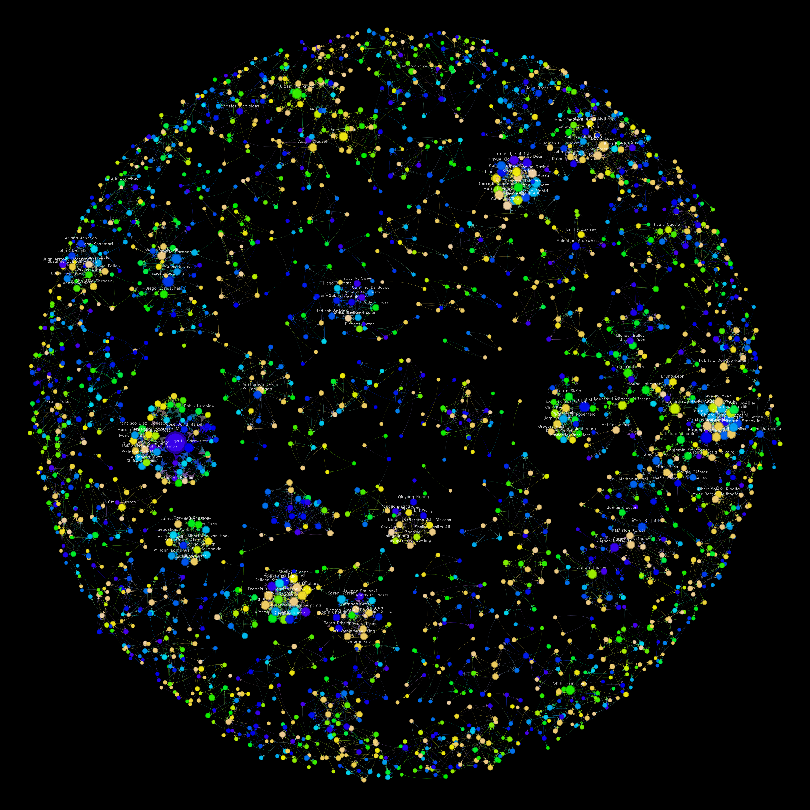

# Networks 2021: Joint Network Science and Sunbelt Conference

These network visualizations use the [`netplot`](https://github.com/USCCANA/netplot)
R package. Please feel free to submit a PR to improve the output of this viz.

## Co-presenters network

This graph was created from the list of contributed speakers and poster presenters
available [here](http://bit.ly/H8jfhglwuvn) (as of June 21, 2021). Vertices are
colored by each vertices' most frequent session (more relevant, probably). Scales
of vertex and labels are given by degree, and only the top 200 vertices (in terms
of degree) are shown.

Can you find yourself in this figure?

