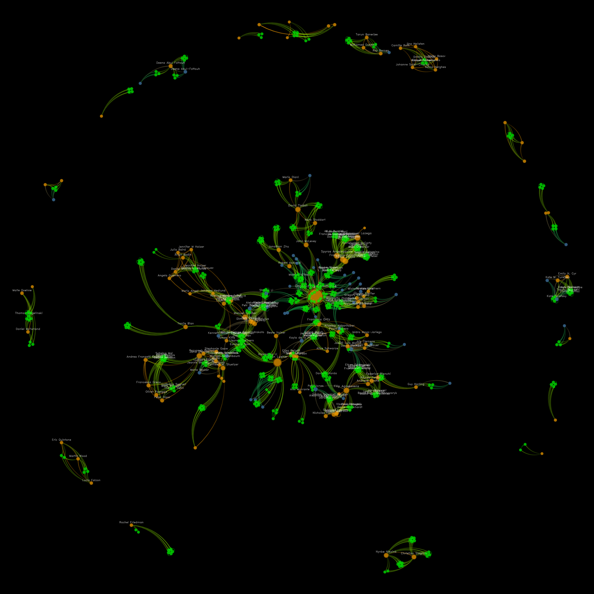
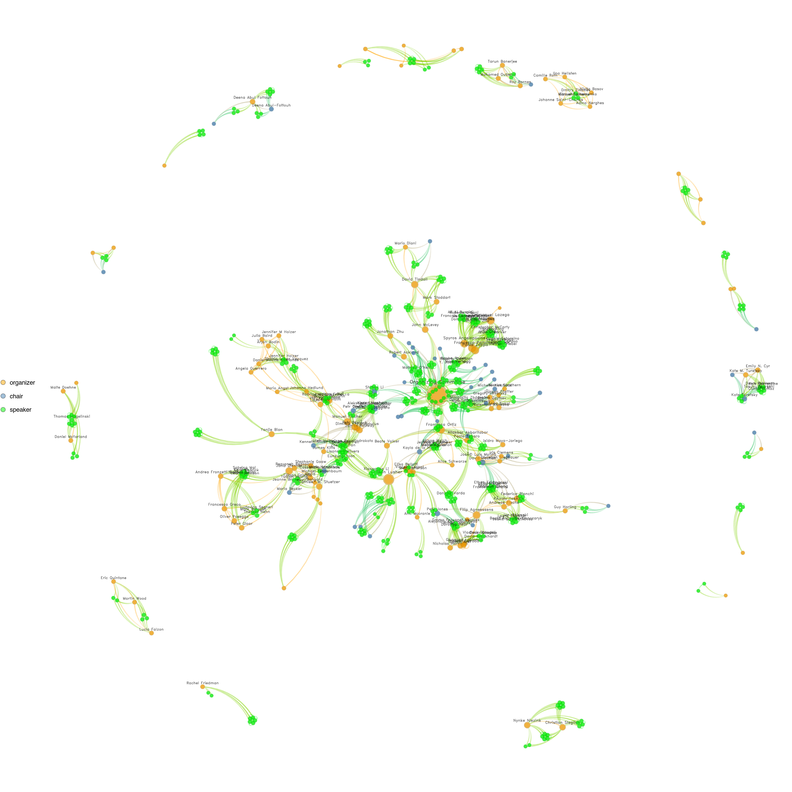

# Sunbelt 2022 conference

The figures were drawn with the [`netplot` R package](https://cran.r-project.org/package=netplot).
Nodes are speakers/chairs/organizers at the [Sunbelt 2022 conference in Cairns, Australia](https://www.sunbelt2022.org/).
Nodes are connected if they appear together in the same session. To generate the figure, I did the following:

1. Download the PDF version of the program.

2. Use [`pdf2txt`](https://manpages.ubuntu.com/manpages/xenial/man1/pdf2txt.1.html) to extract the text. The resulting file
is called [agenda.txt](agenda.txt).

3. Using the R script [`agenda_data.R`](agenda_data.R), process the program
and extract information about presentations and sessions. 
Most of the heavy-lifting was done using [regular expressions](https://xkcd.com/208/).

4. Using [igraph](https://cran.r-project.org/package=igraph) in the Rscript [`network_free.R`](network_free.R), generate the projected
version of the affiliation network.

5. Draw a pretty network using [`netplot`](https://cran.r-project.org/package=netplot).

You can take a look at the 
