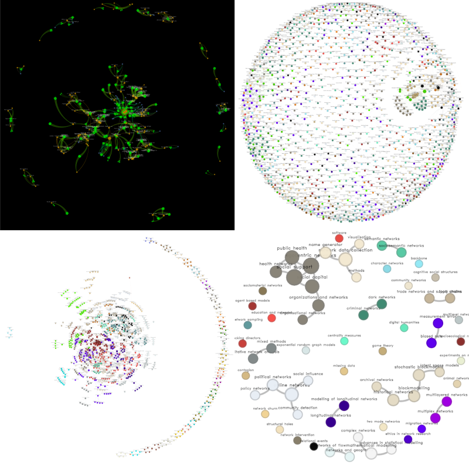
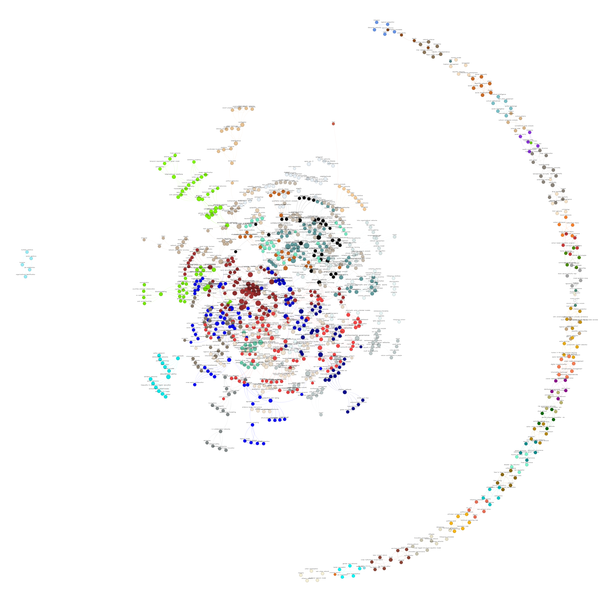
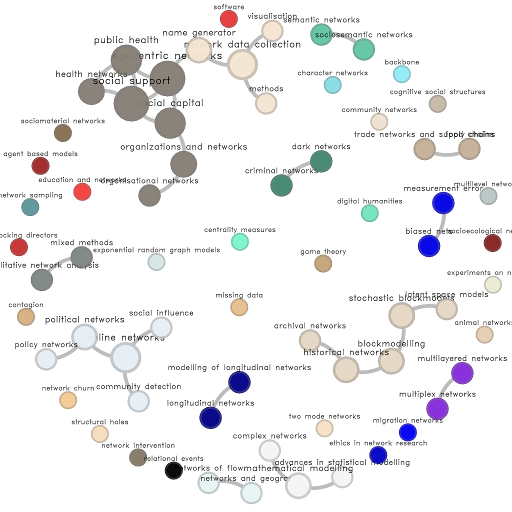

# Sunbelt 2022 conference

For this year's [**International Network of Social Network Analysis**](https://www.insna.org/) Sunbelt conference, I have created four different network visualizations. All of them use mainly three R packages: [data.table](https://cran.r-project.org/package=data.table), [igraph](https://cran.r-project.org/package=igraph), [netplot](https://cran.r-project.org/package=netplot), and [rgexf](https://cran.r-project.org/package=rgexf).

1. [**Co-session network**](#co-session-network): Uses the online version of the program. Nodes are people and ties are given by nodes co-occurring within a session. Nodes are colored according to their roles: speaker, session chair, session organizer.

2. [**Co-authorship network**](#co-authorship-network): Part of the Sunbelt2022 [data viz challenge](https://github.com/johankoskinen/Sunbelt2022), nodes are authors and ties represent co-authorship. Nodes are colored by their most frequent topic; thus, authors with multiple papers will be assigned to the most popular topic in their submissions.

3. [**Keyword network**](#keywords-network): Also part of the data viz challenge, this network shows how keywords are related. Each node represents a keyword, and two keywords are connected if their [Jaccard index]()--which is used to measure co-occurrence--is above a threshold. Colors are given by clustering using the Louvain algorithm in igraph.

4. [**Topics network**](#topics-network): Same idea as the keyword network; two topics are related if these show up in the same paper.

All visualizations have two versions: a PNG file and an interactive html document.

## Co-session network

You can access the interactive version [here](https://gvegayon.github.io/gallery/20220700-sunbelt/gexfjs/). To generate the figure, I did the following:

1. Download the PDF version of the program.

2. Use [`pdf2txt`](https://manpages.ubuntu.com/manpages/xenial/man1/pdf2txt.1.html) to extract the text. The resulting file
is called [agenda.txt](agenda.txt).

3. Using the R script [`agenda_data.R`](agenda_data.R), process the program
and extract information about presentations and sessions. 
Most of the heavy-lifting was done using [regular expressions](https://xkcd.com/208/).

4. Using [igraph](https://cran.r-project.org/package=igraph) in the Rscript [`network_free.R`](network_free.R), generate the projected
version of the affiliation network.

5. Draw a pretty network using [`netplot`](https://cran.r-project.org/package=netplot).

## Co-authorship network

The file used to generate this network is [`coauthor.R`](coauthor.R). You can access the interactive version [here](https://gvegayon.github.io/gallery/20220700-sunbelt/coauthor/)

## Keywords network

The file used to generate this network is [`keywords.R`](keywords.R). You can access the interactive version [here](https://gvegayon.github.io/gallery/20220700-sunbelt/keywords/)

## Topics network

The file used to generate this network is [`topics.R`](topics.R). You can access the interactive version [here](https://gvegayon.github.io/gallery/20220700-sunbelt/topics/)

