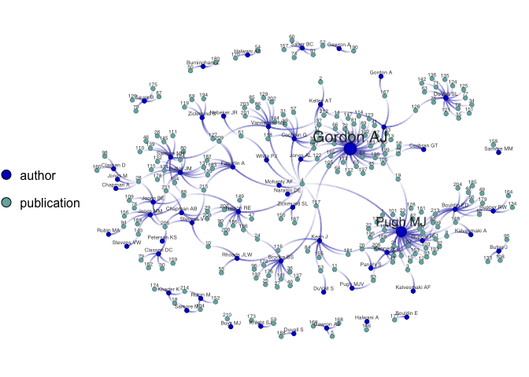

# IDEAS investigators at UofU and VA
George G. Vega Yon
2025-01-13

The following document processes data from the UofU IDEAS center about
coauthorship. Using an excel file (which was unzipped to
`publication_list`), it identifies authors in bold and extracts the
journal information. The data is then used to create a network plot of
coauthorship.

You can see an interactive session
[here](https://gvegayon.github.io/gallery/20250113-sunbelt/coauthor/).

``` r
library(xml2)
library(data.table)
dat <- read_xml("publication_list/xl/sharedStrings.xml") |>
    xml_children()

# Processing identifying bold text (usually authors)
dat <- lapply(dat, \(d) {
  xml_children(d) |> as_list() |>
  lapply(\(x) {

    is_bold <-  x[["rPr"]][["b"]]

    data.table(
      format_bold = if (is.list(is_bold)) TRUE else FALSE,
      content = x[["t"]]
    )
  }) |> rbindlist()
})

# Extracting the authors
authors <- lapply(dat, \(d) {

  auth <- tryCatch({
    x <- unlist(d[-c(.N)][format_bold == TRUE]$content)

    x <- strsplit(x, split=",") |> unlist()
    gsub("^\\s+|\\s+$|[[:punct:]]+$", "", x)
  }, error = \(e) e)

  if (inherits(auth, "error")) return(NULL)

  journal <- d[grepl("doi\\s*:|PMC", content)]$content[1][[1]]

  if (!inherits(journal, "character")) return(NULL)

  data.table(
    authors = auth,
    journal = journal
  )
 

})

# Droping missing
authors <- authors[sapply(authors, length) == 2]

authors <- lapply(seq_along(authors), \(i) {
  authors[[i]]$id <- i
  authors[[i]]
}) |> rbindlist()

fwrite(authors, "authors.csv")
```

``` r
library(netplot)
```

    Loading required package: grid

``` r
library(igraph)
```


    Attaching package: 'igraph'

    The following object is masked from 'package:netplot':

        ego

    The following objects are masked from 'package:stats':

        decompose, spectrum

    The following object is masked from 'package:base':

        union

``` r
net <- graph_from_data_frame(
  authors[, .(ego = authors, alter = id)] |> as.data.frame(),
  vertices = rbind(
    unique(authors[, .(id = as.character(id), type = "publication")]),
    unique(authors[, .(id = authors, type = "author")])
  ),
  directed = FALSE
)

set.seed(331)
library(RColorBrewer)
palette(c("#0003C9", "#8f56ba", "#76b0b0"))

net_netplot <- nplot(
  net,
  vertex.color = ~type,
  edge.line.breaks = 10,
  vertex.nsides = rep(20, vcount(net)),
  vertex.label.show  = 1,
  )

# Drawing
net_netplot
```



``` r
# Storing information
net <- set_graph_attr(net, "layout", net_netplot$.layout)
V(net)$color <- get_vertex_gpar(net_netplot, element = "core", "fill")$fill
```

Now the GEXF figure!

``` r
library(rgexf)
gf <- igraph.to.gexf(
  net,
  nodesVizAtt = list(
    position = cbind(graph_attr(net, "layout"), 0),
    color    = col2rgb(V(net)$color) |> t(),
    size     = sqrt(degree(net) + 4)
  )
)

plot(
  gf,
  minEdgeWidth   = .5,
  maxEdgeWidth   = 1,
  nodeSizeFactor = 2,
  zoomLevel      = 0,
  dir            = "coauthor",
  graphFile      = "sunbelt2022_coauthor.gexf"
)
```

    GEXF graph successfully written at:
    /Users/u6039184/Documents/contents/gallery/20251013-ideas-investigators/coauthor/sunbelt2022_coauthor.gexf
